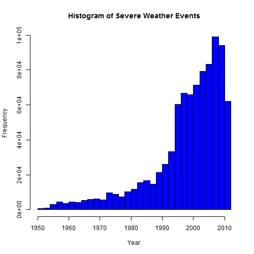
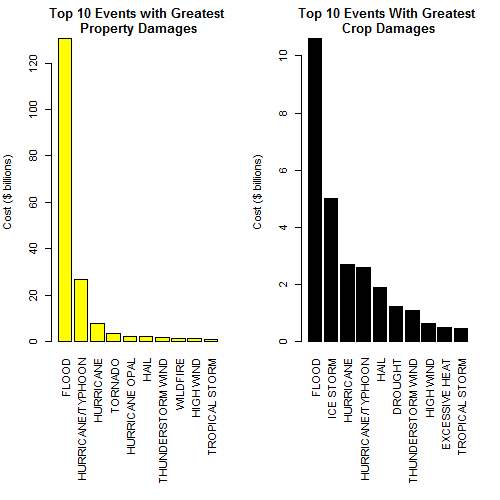
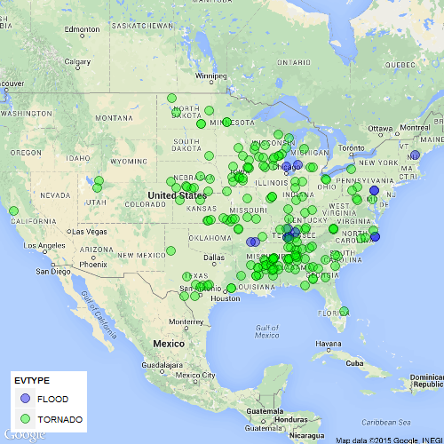

## Synopsis
This is a report created based on the analysis on U.S. National Oceanic and Atmospheric Administration¡¯s (NOAA) storm database. The dataset consists of the types of the natural event, reported injuries and fatalities, economical costs including damages on properties and crops. This report aims to analyze and find out the natural event(s) that harm human and/or properties/crops most seriously in U.S. The top 10 event types that harm human and/or properties/crops are reported in this report.

## Data Processing
The analysis was performed on Storm Events Database, provided by National Climatic Data Center. The data is from a comma-separated-value file available here. There is also some documentation of the data available here. Import packages that will be used.


```r
echo = TRUE 
library(data.table); library(knitr); library(ggplot2); library(ggmap); library(dplyr)
opts_chunk$set(cache=TRUE)
```

Unzip and read the data.


```r
# download file from URL
if (!file.exists("D:/Coursera_R/storm.csv.bz2")) {
    download.file("https://d396qusza40orc.cloudfront.net/repdata%2Fdata%2FStormData.csv.bz2", "D:/Coursera_R/storm.csv.bz2")
}
# unzip file 
if (!file.exists("D:/Coursera_R/storm.csv")) {
    library(R.utils)
    bunzip2("D:/Coursera_R/storm.csv.bz2", "D:/Coursera_R/storm.csv", overwrite=TRUE, remove = FALSE)
}

storm <- data.table(read.table("storm.csv", header=T, sep=",", nrows=902298, 
                na.strings="", colClasses = c("NULL", "character", rep("NULL", 5),   
                                              "factor", rep("NULL", 14), 
                                              rep("numeric", 3), "character", 
                                              "numeric", "character", rep("NULL", 3), 
                                              rep("numeric", 4), rep("NULL", 2) )))
dim(storm)
```

```
## [1] 902297     12
```

Take a look at trdency of the bad weather events from 1950 to 2011.

```r
Date <- as.numeric(format(as.Date(storm$BGN_DATE, format = "%m/%d/%Y %H:%M:%S"), "%Y"))
hist(Date, breaks = 30, xlab="Year", ylab="Frequency",main="Histogram of Severe Weather Events", col="blue")
```

 

## Subset and Clean Up Most Relevant Event Types


```r
# subset to remove events without damage
storm.damage <- filter(storm, PROPDMG !=0, CROPDMG != 0)
storm.damage$PROPDMGEXP <- as.character(storm.damage$PROPDMGEXP)
storm.damage$CROPDMGEXP <- as.character(storm.damage$CROPDMGEXP)
# Discard data with missint --EXP values
storm.damage <- subset(storm.damage, PROPDMGEXP!="" & CROPDMGEXP!="")
```


```r
#Clean up major event types: 
# ----- FLOOD -----
storm.damage$EVTYPE <- gsub("^.*((?!FLASH).).*FLOOD.*$","FLOOD",storm.damage$EVTYPE, perl=TRUE)
storm.damage$EVTYPE <- gsub("^URBAN.*$","FLOOD",storm.damage$EVTYPE)
storm.damage$EVTYPE <- gsub("^RIVER.*$","FLOOD",storm.damage$EVTYPE)
# ----- TORNADO -----
storm.damage$EVTYPE <- gsub(".*TORNADO.*","TORNADO",storm.damage$EVTYPE)
# ---- THUNRDERSTORM WIND -----
storm.damage$EVTYPE <- gsub("^.*THUNDER.*WIND.*$","THUNDERSTORM WIND",storm.damage$EVTYPE)
storm.damage$EVTYPE <- gsub(".*TSTM.*","THUNDERSTORM WIND",storm.damage$EVTYPE)
```


## Preparing the Property and Crop Damage Data

```r
dt <- storm.damage
# exploring the property exponent
unique(dt$PROPDMGEXP)
```

```
## [1] "B" "M" "m" "K" "5" "0" "3"
```

```r
# Sorting the property exponent data
dt$PROPEXP[dt$PROPDMGEXP == "K"] <- 1000
dt$PROPEXP[dt$PROPDMGEXP == "M"] <- 1e+06
dt$PROPEXP[dt$PROPDMGEXP == "B"] <- 1e+09
dt$PROPEXP[dt$PROPDMGEXP == "m"] <- 1e+06
dt$PROPEXP[dt$PROPDMGEXP == "5"] <- 1e+05
dt$PROPEXP[dt$PROPDMGEXP == "6"] <- 1e+06
dt$PROPEXP[dt$PROPDMGEXP == "4"] <- 10000
dt$PROPEXP[dt$PROPDMGEXP == "2"] <- 100
dt$PROPEXP[dt$PROPDMGEXP == "3"] <- 1000
dt$PROPEXP[dt$PROPDMGEXP == "h"] <- 100
dt$PROPEXP[dt$PROPDMGEXP == "7"] <- 1e+07
dt$PROPEXP[dt$PROPDMGEXP == "H"] <- 100
dt$PROPEXP[dt$PROPDMGEXP == "1"] <- 10
dt$PROPEXP[dt$PROPDMGEXP == "8"] <- 1e+08
# compute the property damage value
dt$PROPDMGVAL <- dt$PROPDMG * dt$PROPEXP
# exploring the crop exponent data
unique(dt$CROPDMGEXP)
```

```
## [1] "M" "K" "m" "k" "B" "0"
```

```r
# Sorting the property exponent data
dt$CROPEXP[dt$CROPDMGEXP == "M"] <- 1e+06
dt$CROPEXP[dt$CROPDMGEXP == "K"] <- 1000
dt$CROPEXP[dt$CROPDMGEXP == "m"] <- 1e+06
dt$CROPEXP[dt$CROPDMGEXP == "B"] <- 1e+09
dt$CROPEXP[dt$CROPDMGEXP == "k"] <- 1000
dt$CROPEXP[dt$CROPDMGEXP == "2"] <- 100
# compute the crop damage value
dt$CROPDMGVAL <- dt$CROPDMG * dt$CROPEXP
```


## Aggregate the Data by Events

```r
# aggregate the data by event
fatal <- aggregate(FATALITIES ~ EVTYPE, dt, sum)
injury <- aggregate(INJURIES ~ EVTYPE, dt, sum)
casualties <- merge(fatal, injury)
propdmg <- aggregate(PROPDMGVAL ~ EVTYPE, dt, sum)
cropdmg <- aggregate(CROPDMGVAL ~ EVTYPE, dt, sum)
casualties10 <- casualties[order(-casualties$FATALITIES, -casualties$INJURIES), ][1:10, ]
```

## Results

```r
kable(casualties10, format = "markdown")
```


|   |EVTYPE            | FATALITIES| INJURIES|
|:--|:-----------------|----------:|--------:|
|8  |FLOOD             |        229|     6699|
|53 |TORNADO           |        219|     2287|
|6  |EXCESSIVE HEAT    |         46|       18|
|38 |HURRICANE/TYPHOON |         40|      909|
|58 |TSUNAMI           |         32|      129|
|62 |WILDFIRE          |         31|      137|
|33 |HURRICANE         |         29|       22|
|22 |HEAT              |         22|      470|
|29 |HIGH WIND         |         18|      213|
|51 |THUNDERSTORM WIND |         16|      361|


```r
# get top 10 events with highest property damage
propdmg10 <- propdmg[order(-propdmg$PROPDMGVAL), ][1:10, ]
# get top 10 events with highest crop damage
cropdmg10 <- cropdmg[order(-cropdmg$CROPDMGVAL), ][1:10, ]
par(mfrow = c(1, 2), mar = c(12, 4, 3, 2), mgp = c(3, 1, 0), cex = 0.8)
barplot(propdmg10$PROPDMGVAL/(10^8), las = 3, names.arg = propdmg10$EVTYPE, main = "Top 10 Events with Greatest\n Property Damages", ylab = "Cost of damages ($ billions)",col = "yellow")
barplot(cropdmg10$CROPDMGVAL/(10^2), las = 3, names.arg = cropdmg10$EVTYPE, main = "Top 10 Events With Greatest\n Crop Damages", ylab = "Cost of damages ($ billions)", col = "black")
```

 

Last, take a look at the spatial analysis of the harzard weather events. Here only the spatial distributions of 'Flood' and 'TORNADO' events are examined. As shown in the figure, there are clearly more recorded tornado events than flood. Both types of events are more frequent in the East/Central regions.


```r
# Subset with event types and damages
Selected.Events <- filter(storm, EVTYPE=="TORNADO" | EVTYPE=="FLOOD")
Selected.Events <- filter(Selected.Events, PROPDMG !=0, CROPDMG != 0, FATALITIES + INJURIES !=0)
# The geocode conversion: x=-LONGITUDE/100, y=LATITUDE/100
ggmap(get_map("United States",maptype="roadmap", zoom = 4), extent="device") +
    geom_point(data=Selected.Events, aes(x=-LONGITUDE/100, y=LATITUDE/100, fill=EVTYPE), color="black", pch=21, size=5, alpha=0.4) +
    scale_fill_manual(values=c("blue", "green", "red")) +
    theme(legend.justification=c(0,0), legend.position=c(0,0))
```

```
## Map from URL : http://maps.googleapis.com/maps/api/staticmap?center=United+States&zoom=4&size=%20640x640&scale=%202&maptype=roadmap&sensor=false
## Google Maps API Terms of Service : http://developers.google.com/maps/terms
## Information from URL : http://maps.googleapis.com/maps/api/geocode/json?address=United+States&sensor=false
## Google Maps API Terms of Service : http://developers.google.com/maps/terms
```

```
## Warning: Removed 77 rows containing missing values (geom_point).
```

 

## Conclusion
From the data, excessive heat and tornado are most harmful with respect to population health, while flood, drought, and hurricane/typhoon have the greatest economic consequences.


